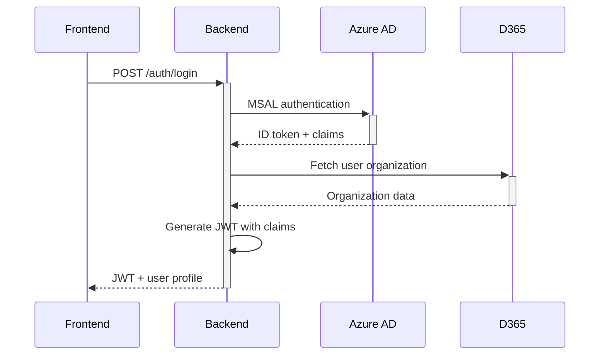

# Backend Architecture

## Overview
The Partner Portal backend is a Node.js Express API that serves as the secure gateway between the React frontend and Microsoft Dynamics 365. It enforces multi-tenant security through initiative-based data segregation.

## Core Architecture Principles

### 1. Security-First Design
- **Initiative Isolation**: All data queries are filtered by user's initiative (derived from Entra ID groups)
- **Organization Scoping**: Secondary filtering based on user's organization and type (Foster/Volunteer)
- **Fail-Secure**: Missing security context results in empty responses, never data leakage

### 2. Layered Architecture
```
┌─────────────────┐
│   Controllers   │  HTTP request handling, validation
├─────────────────┤
│    Services     │  Business logic, D365 integration
├─────────────────┤
│   Middleware    │  Auth, security filters, logging
├─────────────────┤
│     Types       │  TypeScript interfaces (shared)
└─────────────────┘
```

### 3. Modular Services
Services are broken into focused, reusable modules:
- **Core Services**: Auth, JWT, D365 client
- **Domain Services**: Lead (refactored with focused helper methods)
- **Utility Services**: OData query builders, field mappers, validators
- **Infrastructure**: Retry logic (with exponential backoff), D365 error parsing, comprehensive audit logging

## Authentication Flow



## Security Middleware Stack

1. **authenticateToken**: Validates JWT and extracts user context
2. **enforceInitiative**: Injects D365 security filter based on groups
3. **requireRoles**: Enforces role-based access control
4. **auditLog**: Logs all data access for security monitoring

## Infrastructure Patterns

### Retry Logic
All D365 API calls use exponential backoff retry logic:
- Default: 3 retries with 2x backoff
- Retryable status codes: 429, 500, 502, 503, 504
- Network errors automatically retried
- Configurable per service

### Error Handling
Consistent error handling across services:
- D365 errors parsed to user-friendly messages
- Security failures logged with audit events
- Fail-secure approach (empty results on errors)
- No internal details exposed to clients

## D365 Integration Pattern

### Query Security
Every D365 query MUST include:
```typescript
{
  initiative: string,        // Primary security boundary
  organizationId?: string,   // Secondary filter
  organizationLeadType?: string // Determines filter type
}
```

### Organization-Based Filtering
- **Foster Organizations**: Direct filter on `_tc_fosterorganization_value`
- **Volunteer Organizations**: Many-to-many relationship via `tc_eclead_tc_ecleadsvolunteerorg_eclead`
- **Dual Organizations**: OR condition combining both filters

## API Structure

### Endpoint Pattern
```
/api/v1/{resource}          # Collection operations
/api/v1/{resource}/:id      # Single resource operations
/api/v1/{resource}/stats    # Aggregated data
```

### Standard Response Format
```typescript
{
  data?: T,                 // Requested data
  error?: string,           // Error message
  code?: string,            // Error code
  message?: string,         // Success message
  meta?: {                  // Pagination metadata
    total: number,
    page: number,
    limit: number
  }
}
```

## Error Handling

### Error Types
- **AppError**: Application-specific errors with status codes (using factory methods)
- **ValidationError**: Request validation failures (400)
- **AuthError**: Authentication/authorization failures (401/403)
- **D365Error**: External service failures with detailed parsing

### Centralized Error Handler
The lead service implements a comprehensive `handleD365QueryError` method that:
- Parses D365-specific error responses
- Provides structured error context for debugging
- Distinguishes between 404 (not found) vs 403 (forbidden) errors
- Logs errors with full operation context

### Error Response Codes
- `UNAUTHORIZED`: Missing or invalid authentication
- `FORBIDDEN`: Insufficient permissions
- `NOT_FOUND`: Resource not found or access denied
- `VALIDATION_ERROR`: Invalid request data
- `D365_ERROR`: D365 service failure (with retry logic)
- `INTERNAL_ERROR`: Unexpected server error

## Performance Considerations

### Caching Strategy
- JWT tokens cached for 15 minutes
- D365 access tokens cached until expiry
- No data caching (real-time D365 queries)

### Query Optimization
- Limit $expand operations to required fields
- Default pagination limit: 50, max: 100
- Use $select to minimize payload size
- Batch related queries when possible
- Field selections cached at service initialization

## Service Implementation Patterns

### Lead Service Architecture (Phase 3 Refactored)
The lead service demonstrates best practices for maintainability:

```typescript
class LeadService {
  // Cached field selections for performance
  private readonly selectClause = buildLeadSelectClause();
  private readonly expandClause = buildLeadExpandClause();
  
  // Retry configuration with exponential backoff
  private readonly retryOptions: RetryOptions = {
    maxRetries: 3,
    initialDelay: 1000,
    backoffFactor: 2,
    retryableStatusCodes: [429, 500, 502, 503, 504]
  };
  
  // Focused helper methods (single responsibility)
  private applyActiveRecordFilter(filters: string[]): void
  private applyInitiativeFilter(filters: string[], initiativeFilter: D365Filter): void
  private validateOrganizationType(type: string, filter: D365Filter): Promise<void>
  private buildOrganizationFilters(filter: D365Filter): Promise<string[]>
  private applyUserSearchFilters(filters: string[], userFilters?: LeadFilters): void
  private handleD365QueryError(error: unknown, context: D365ErrorContext): Promise<never>
  private buildODataQueryParams(options: D365QueryOptions, filter?: string): ODataQueryParams
  private executeD365Query(...) { }  // With retry logic
  private getD365InitiativeGuid(...) { }
  private buildUserOrganization(...) { }
}
```

### Key Patterns:
1. **Cached Constants**: Field selections computed once at startup
2. **Retry Wrapper**: All D365 calls wrapped with exponential backoff retry logic
3. **Focused Helper Methods**: Single responsibility methods (max 30 lines)
4. **Type Safety**: Zero `any` types, all methods have explicit return types
5. **Error Context**: Centralized error handling with structured context
6. **Security**: All user input escaped with `escapeODataString`
7. **Fail-Secure**: Invalid contexts return empty results
8. **Audit Logging**: All security events tracked with comprehensive context

## Monitoring & Logging

### Log Levels
- `ERROR`: System failures requiring attention
- `WARN`: Security violations, degraded performance
- `INFO`: Normal operations, audit trail
- `DEBUG`: Detailed troubleshooting (dev only)

### Security Events
All security-relevant events are logged:
- Authentication attempts
- Cross-initiative access attempts
- Data access with filter context
- Permission denials

## Deployment Architecture

### Environment Variables
Critical configuration via environment:
- `D365_URL`: Dynamics instance URL
- `AZURE_*`: Authentication configuration
- `JWT_SECRET`: Token signing key
- `NODE_ENV`: Runtime environment

### Health Checks
- `/health`: Basic service status
- `/health/ready`: D365 connectivity check
- `/health/live`: Detailed component status

## Best Practices

### Service Development
1. Always use TypeScript interfaces
2. Validate input with Zod schemas
3. Handle null/undefined gracefully
4. Log security context for all data access
5. Write unit tests for business logic

### Security Guidelines
1. Never bypass initiative filtering
2. Validate all user input
3. Use parameterized queries
4. Audit log sensitive operations
5. Fail securely (deny by default)

### API Design
1. Use RESTful conventions
2. Version APIs from day one
3. Provide clear error messages
4. Document response schemas
5. Support pagination for lists

## Common Patterns

### Secure Query Builder
```typescript
const filter = buildSecureODataFilter(
  initiativeFilter,  // From middleware
  userFilters       // From request
);
```

### Error Handling
```typescript
try {
  // Operation
} catch (error) {
  if (error instanceof AppError) throw error;
  throw new AppError('Operation failed', 500);
}
```

### Initiative Verification
```typescript
if (resource.initiative !== userInitiative) {
  logSecurityEvent('CROSS_INITIATIVE_ATTEMPT', context);
  return null; // Appear as not found
}
```